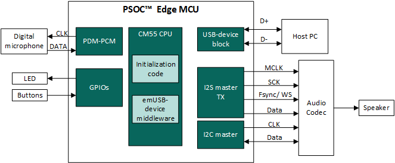
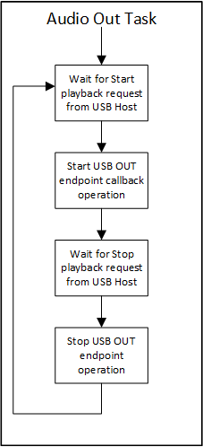
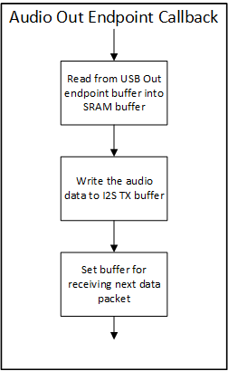
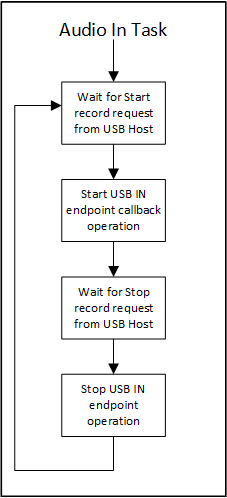
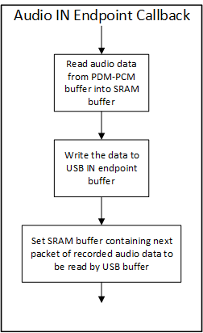
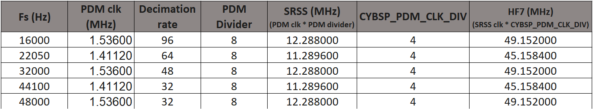
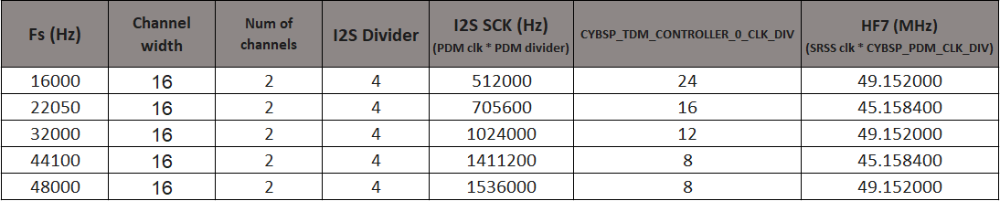

[Click here](../README.md) to view the README.

## Design and implementation

The design of this application is minimalistic to get started with code examples on PSOC&trade; Edge MCU devices. All PSOC&trade; Edge E84 MCU applications have a dual-CPU three-project structure to develop code for the CM33 and CM55 cores. The CM33 core has two separate projects for the secure processing environment (SPE) and non-secure processing environment (NSPE). A project folder consists of various subfolders, each denoting a specific aspect of the project. The three project folders are as follows:

**Table 1. Application projects**

Project | Description
--------|------------------------
*proj_cm33_s* | Project for CM33 secure processing environment (SPE)
*proj_cm33_ns* | Project for CM33 non-secure processing environment (NSPE)
*proj_cm55* | CM55 project

<br>

In this code example, at device reset, the secure boot process starts from the ROM boot with the secure enclave (SE) as the root of trust (RoT). From the secure enclave, the boot flow is passed on to the system CPU subsystem where the secure CM33 application starts. After all necessary secure configurations, the flow is passed on to the non-secure CM33 application. Resource initialization for this example is performed by this CM33 non-secure project. It configures the system clocks, pins, clock to peripheral connections, and other platform resources. It then enables the CM55 core using the `Cy_SysEnableCM55()` function and the CM33 core is put to DeepSleep mode.

The CM55 CPU executes the firmware for the USB audio playback device.

The PSOC&trade; Edge MCU device works as a bridge between the audio data streamed from the USB host and the I2S block, which connects to an audio codec. The audio codec outputs the audio data to a speaker or headphones.

The kit user buttons are used to change the volume of the audio played through PSOC&trade; Edge MCU kit speakers. Any press of buttons is reported back to the host over USB HID consumer control.

**Figure 1. Block diagram**



The KIT_PSE84_EVAL kit comes with a digital microphone and TLV320DAC1300 audio codec. The PDM/PCM hardware block of PSOC&trade; Edge MCU device converts this digital signal to a quantized 16-bit value (PCM).

In this application, the sampling rate is configured to 48 kHz/ksps. The word length of the PDM/PCM Rx buffer and the I2S Tx buffer are set to 16 bits.

I2S hardware block of PSOC&trade; Edge MCU can provide MCLK. The MCLK provided by the I2S hardware block is an interface clock of the I2S hardware block. I2S hardware block provides 1.024-MHz SCLK to sample at 16 kHz. To achieve the desired sampling frequency required by DAC of TLV320DAC3100 codec, multiple dividers are provided internal to codec. For supported sampling rates these dividers combinations are readily provided in the codec TLV320DAC3100 source code.

The code example contains an I2C controller, through which PSOC&trade; MCU configures the audio codec. The code example includes the TLV320DAC3100 source code (located in *proj_cm55/* folder) to easily configure the TLV320DAC3100.


### Firmware details

The firmware implements a bridge between the PDM-PCM, USB, and I2S blocks. The emUSB descriptor implements the USB Audio Class with two endpoints and the HID device class with one endpoint:

- **Audio IN endpoint:** Sends the audio data to the USB host
- **Audio OUT endpoint:** Receives the audio data from the USB host
- **HID audio/playback control endpoint:** Controls the volume

The example project firmware uses FreeRTOS on the CM55 CPU. The following tasks are created for executing various functionalities:

- **Audio app task:** Implements USB initializations, receives requests from USB host through audio control endpoint, and handles volume control

- **Audio IN task:** Implements the functions related to the audio IN Endpoint

- **Audio OUT task:** Implements the functions related to the audio OUT Endpoint

- **Idle task:** Goes to sleep

**Figure 2. Audio OUT endpoints flow**

  

**Figure 3. Audio IN endpoint flow**

  

The app task populates endpoint descriptors and initializes the audio and HID classes, and initializes the audio codec. It then starts the emUSB-device stack, which allows the device to be enumerated by the host. The app task schedules the In and Out tasks and then receives and sends audio control request through audio control callback. The app task also handles volume changed based on user button press.

The Audio IN task carries out PDM-PCM initialization and schedules the `USBD_AUDIO_Write_Task()`, which waits for receiving `USB_AUDIO_RECORD_START` request from host. When it receives the request, it starts the audio in endpoint callback. The callback reads data from PDM-PCM buffer, which contains the recorded data from microphones, and writes it to USB IN endpoint buffer. The in callback operation is suspended on receiving `USB_AUDIO_RECORD_STOP` request from host.

The Audio OUT task carries out I2S initialization and schedules the `USBD_AUDIO_Read_Task()`. This task then waits for `USB_AUDIO_PLAYBACK_START` request from USB host for starting the audio out endpoint callback. On receiving the request, the audio endpoint reads the data from USB Out endpoint buffer, which is sent by the host. This data is then sent to the audio codec via I2S Tx channel. The out callback operation is suspended on receiving `USB_AUDIO_PLAYBACK_STOP` request from host.


### Audio data flow

```
Frame size = Sample rate x Number of channels x Transfer time
```

In this example, the device records stereo data through 2x PDM microphones. Therefore, the frame size for 16 ksps sampling rate is 32 samples (16000 x 2 x 0.001)<sup>1</sup>. Accordingly, the Audio IN and OUT endpoints are initialized with maximum packet sizes of 34 samples<sup>2</sup>. The I2S channel transmits stereo data received from Out endpoint buffer to audio codec. As kit speaker is mono channel speaker, the codec truncates data from 1 channel while playing it to speaker.

> **Note:** The polling period for USB endpoint buffers is 1 ms.


### Changing sampling rate

To change the sampling rate of the USB audio recorder, change the value of `AUDIO_IN_SAMPLE_FREQ` and `AUDIO_OUT_SAMPLE_FREQ` declared in the *proj_cm33_ns/include/audio.h* file.


#### PDM-PCM configurations

The operating frequency for PDM microphone available on the kit is 1.05 MHz to 1.9 MHz.

The following equation provides relation between PDM microphone clock and required sampling rate.

```
PDM microphone clock frequency = Sampling frequency X Decimation rate
```

The required PDM clock is then supplied by setting appropriate values of DPLL_LP1, HF7, and CYBSP_TDM_CONTROLLER_0_CLK_DIV peripheral clock divider values.

Various decimation rates are achieved by setting the decimation factor of FIR and CIC filters of PDM-PCM block.

**Figure 4** shows the clock and PDM-PCM configurations for all the supported sampling rates.

**Figure 4. Audio configurations**




#### I2S configurations

The following formula shows the I2S SCK frequency required for the sampling rate.

```
I2S SCK frequency = Sampling frequency x # of channels X Sample width (bits)
```

**Figure 5. Audio configurations**




### Limitations

- The emUSB-device descriptor has provision only to initialize IN and OUT endpoints. A third FEEDBACK endpoint cannot be initialized. The purpose of the FEEDBACK endpoint is to synchronize the clocks between the USB host and the PSOC&trade; Edge MCU audio subsystem in the OUT endpoint flow