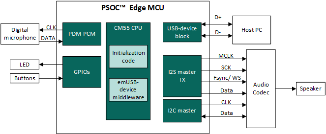
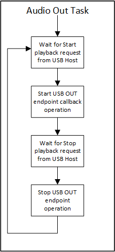
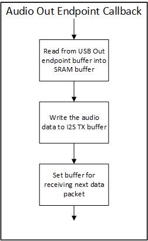
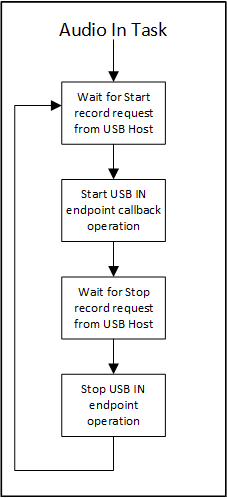
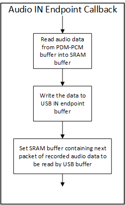
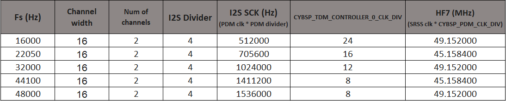

[Click here](../README.md) to view the README.

## Design and implementation

The design of this application is minimalistic to get started with code examples on PSOC&trade; Edge MCU devices. All PSOC&trade; Edge E84 MCU applications have a dual-CPU three-project structure to develop code for the CM33 and CM55 cores. The CM33 core has two separate projects for the secure processing environment (SPE) and non-secure processing environment (NSPE). A project folder consists of various subfolders, each denoting a specific aspect of the project. The three project folders are as follows:

**Table 1. Application projects**

Project | Description
--------|------------------------
*proj_cm33_s* | Project for CM33 secure processing environment (SPE)
*proj_cm33_ns* | Project for CM33 non-secure processing environment (NSPE)
*proj_cm55* | CM55 project

<br>

In this code example, at device reset, the secure boot process starts from the ROM boot with the secure enclave (SE) as the root of trust (RoT). From the secure enclave, the boot flow is passed on to the system CPU subsystem where the secure CM33 application starts. After all necessary secure configurations, the flow is passed on to the non-secure CM33 application. Resource initialization for this example is performed by this CM33 non-secure project. It configures the system clocks, pins, clock to peripheral connections, and other platform resources. It then enables the CM55 core using the `Cy_SysEnableCM55()` function and the CM33 core is put to DeepSleep mode.

The CM55 CPU executes the firmware for the USB audio playback device.

The PSOC&trade; Edge MCU device works as a bridge between the audio data streamed from the USB host and the I2S block, which connects to an audio codec. The audio codec outputs the audio data to a speaker or headphones.

The kit user buttons are used to change the volume of the audio played through PSOC&trade; Edge MCU kit speakers. Any press of buttons is reported back to the host over USB HID consumer control.

**Figure 1. Block diagram**



The KIT_PSE84_EVAL kit comes with a digital microphone and TLV320DAC3100 audio codec. The PDM/PCM hardware block of PSOC&trade; Edge MCU device converts this digital signal to a quantized 16-bit value (PCM).
> **Note:** The KIT_PSE84_HMI supports four PDM microphones. However, this code example is configured to utilize only two microphones.

In this application, the sampling rate is configured to 48 kHz/ksps. The word length of the PDM/PCM Rx buffer and the I2S Tx buffer are set to 16 bits.

I2S hardware block of PSOC&trade; Edge MCU can provide MCLK. The MCLK provided by the I2S hardware block is an interface clock of the I2S hardware block. The I2S hardware block provides the SCLK and MCLK required for the configured 48 kHz sampling rate. To achieve the desired sampling frequency required by DAC of TLV320DAC3100 codec, multiple dividers are provided internal to codec. For supported sampling rates these dividers combinations are readily provided in the codec TLV320DAC3100 source code.

The code example contains an I2C controller, through which PSOC&trade; MCU configures the audio codec. The code example includes the TLV320DAC3100 source code (located in *proj_cm55/* folder) to easily configure the TLV320DAC3100.


### Firmware details

The firmware implements a bridge between the PDM-PCM, USB, and I2S blocks. The emUSB descriptor implements the USB Audio Class with three endpoints and the HID device class with one endpoint:

- **Audio IN endpoint:** Sends the audio data to the USB host
- **Audio OUT endpoint:** Receives the audio data from the USB host
- **Audio Feedback IN endpoint:** Reports the device's actual sample rate to the USB host (USB 2.0 §5.12.4.2), enabling the host to adjust its data rate and avoid buffer underflow/overflow
- **HID audio/playback control endpoint:** Controls the volume

The example project firmware uses FreeRTOS on the CM55 CPU. A single application task, together with the USB audio-class callbacks, executes all functionality:

- **Audio app task:** It performs USB and audio-codec initialization, drains a message queue fed by the USB audio-class callbacks, opens and closes the speaker (RX) and microphone (TX) streams, moves audio data between the USB endpoints and the I2S/TDM and PDM-PCM blocks, and handles volume changes from user button presses

- **Audio feedback (SOF callback):** Runs in the USB Start-of-Frame (SOF) callback context. It monitors the I2S/TDM TX FIFO fill level and reports a 16.16 fixed-point sample-rate value to the host through the feedback ISO IN endpoint using a 3-level threshold algorithm

- **Idle task:** Goes to sleep

**Figure 2. Audio OUT endpoints flow**

  

**Figure 3. Audio IN endpoint flow**

  

The app task populates the audio-class endpoint and interface descriptors (`USBD_AC` flow), initializes the audio and HID classes, and initializes the audio codec. It then starts the emUSB-device stack, which allows the device to be enumerated by the host. Audio streaming is event-driven: when the host activates an alternate interface, the audio-class set-interface callback posts a message (`MSG_SPEAKER_ON`/`MSG_SPEAKER_OFF` or `MSG_MIC_ON`/`MSG_MIC_OFF`) to the app task, which opens or closes the corresponding stream using `USBD_AC_OpenRXStream()` / `USBD_AC_OpenTXStream()`. The app task also handles audio control requests and volume changes from user button presses.

For playback (Audio OUT), the speaker RX callback (`audio_out_rx_callback`) posts `MSG_SPEAKER_DATA` as data arrives from the host; the app task writes that data to the I2S/TDM TX FIFO, which streams it to the audio codec. To keep the host and device clocks synchronized, the feedback SOF callback reports the device's actual consumption rate on the feedback IN endpoint.

For recording (Audio IN), the microphone TX callback (`audio_in_tx_callback`) posts `MSG_MIC_DATA`; the app task reads PCM data captured by the PDM-PCM block and sends it to the host through the audio IN endpoint.


### Audio data flow

```
Frame size = Sample rate x Number of channels x Transfer time
```

In this example, the microphone (Audio IN) captures stereo data through 2x PDM microphones, while the speaker (Audio OUT) plays back mono data. At the configured 48 kHz sampling rate, with a 1 ms USB service interval and 16-bit samples:

- **Audio IN (stereo):** frame size = 48000 x 2 x 0.001 = 96 samples (192 bytes). The IN endpoint maximum packet size is 196 bytes - 192 bytes nominal plus 4 bytes (1 sample per channel) of headroom to accommodate the drift-adjusted sample count when the PDM capture clock runs faster than the USB SOF.
- **Audio OUT (mono):** frame size = 48000 x 1 x 0.001 = 48 samples (96 bytes). The OUT endpoint maximum packet size is 100 bytes - 96 bytes nominal plus 4 bytes of headroom to accommodate the feedback-adjusted (up to +1 kHz) rate.

The kit speaker is a mono channel speaker.

> **Note:** The polling period for USB endpoint buffers is 1 ms.


### Changing sampling rate

To change the sampling rate of the USB audio device, change the value of the single `AUDIO_SAMPLE_FREQ` macro declared in the *proj_cm55/include/audio.h* file to one of the supported `AUDIO_SAMPLING_RATE_*` values. The microphone (IN) and speaker (OUT) streams always run at the same rate; the per-direction `AUDIO_IN_SAMPLE_FREQ` and `AUDIO_OUT_SAMPLE_FREQ` macros are derived from `AUDIO_SAMPLE_FREQ` and must not be edited individually.


#### PDM-PCM configurations

The operating frequency for PDM microphone available on the kit is 1.05 MHz to 3.072 MHz.

The following equation provides relation between PDM microphone clock and required sampling rate.

```
PDM microphone clock frequency = Sampling frequency X Decimation rate
```

The required PDM clock is then supplied by setting appropriate values of DPLL_LP1, CLK_HF7, and CYBSP_PDM_CLK_DIV peripheral clock divider values.

Various decimation rates are achieved by setting the decimation factor of FIR and CIC filters of PDM-PCM block.

The table below shows the clock and PDM-PCM configurations for all the supported sampling rates.

| Fs (Hz) | PDM clk (MHz) | Decimation Rate | PDM Divider |  SRSS (MHz) | CYBSP_PDM_CLK_DIV | CLK_HF7 (MHz) |
| --- | --- | --- | --- | --- | --- | --- | 
| 16000 | 1.5360 | 96 | 8 | 12.2880 | 4 | 49.1520 |
| 22050 | 1.4112 | 64 | 8 | 11.2896 | 4 | 45.1584 |
| 32000 | 2.0480 | 64 | 6 | 12.2880 | 4 | 49.1520 |
| 44100 | 2.8224 | 64 | 4 | 11.2896 | 4 | 45.1584 |
| 48000 | 3.0720 | 64 | 4 | 12.2880 | 4 | 49.1520 |


#### I2S configurations

The following formula shows the I2S SCK frequency required for the sampling rate.

```
I2S SCK frequency = Sampling frequency x # of channels X Sample width (bits)
```

**Figure 4. Audio configurations**




### Feedback endpoint

The USB Audio specification recommends that an asynchronous OUT (speaker) endpoint has an associated feedback IN endpoint. This feedback endpoint reports the device's actual sample consumption rate (in 16.16 fixed-point format at High-Speed) so that the host can adjust its data transmission rate and avoid buffer underflow/overflow.

This code example uses the `USBD_AC_*` audio-class API flow, which provides native support for an explicit feedback endpoint. The feedback endpoint is declared directly in the audio-class endpoint table (`_Endpoints[]` in *proj_cm55/source/usbd_ac_config.c*) as an explicit-feedback isochronous IN endpoint (`USB_ISO_SYNC_TYPE_EXP_FEEDBACK`) and is registered together with the data endpoints by `USBD_AC_Add()`. The reported rate is computed in a Start-of-Frame (SOF) callback, `audio_feedback_sof_callback()` in *proj_cm55/source/audio_app.c*, which is registered through the `pfSOFCallback` and `FeedbackInterval` fields of the RX stream context, and is delivered to the host using `USBD_AC_SetFeedbackDataRate()`.

The feedback algorithm uses a 3-level approach based on the TDM TX FIFO fill level:
- **FIFO above high mark** -> report a slow rate (host reduces data output)
- **FIFO below low mark** -> report a fast rate (host increases data output)
- **FIFO near target** -> report the nominal rate
